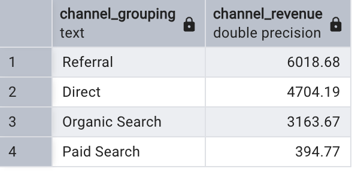
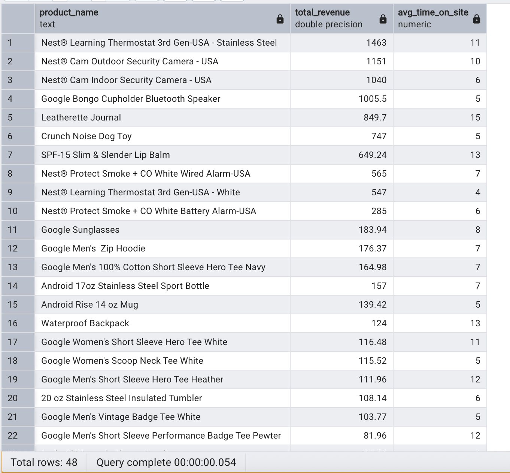
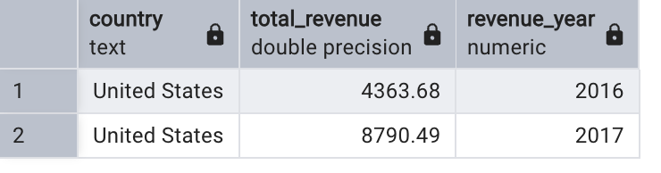
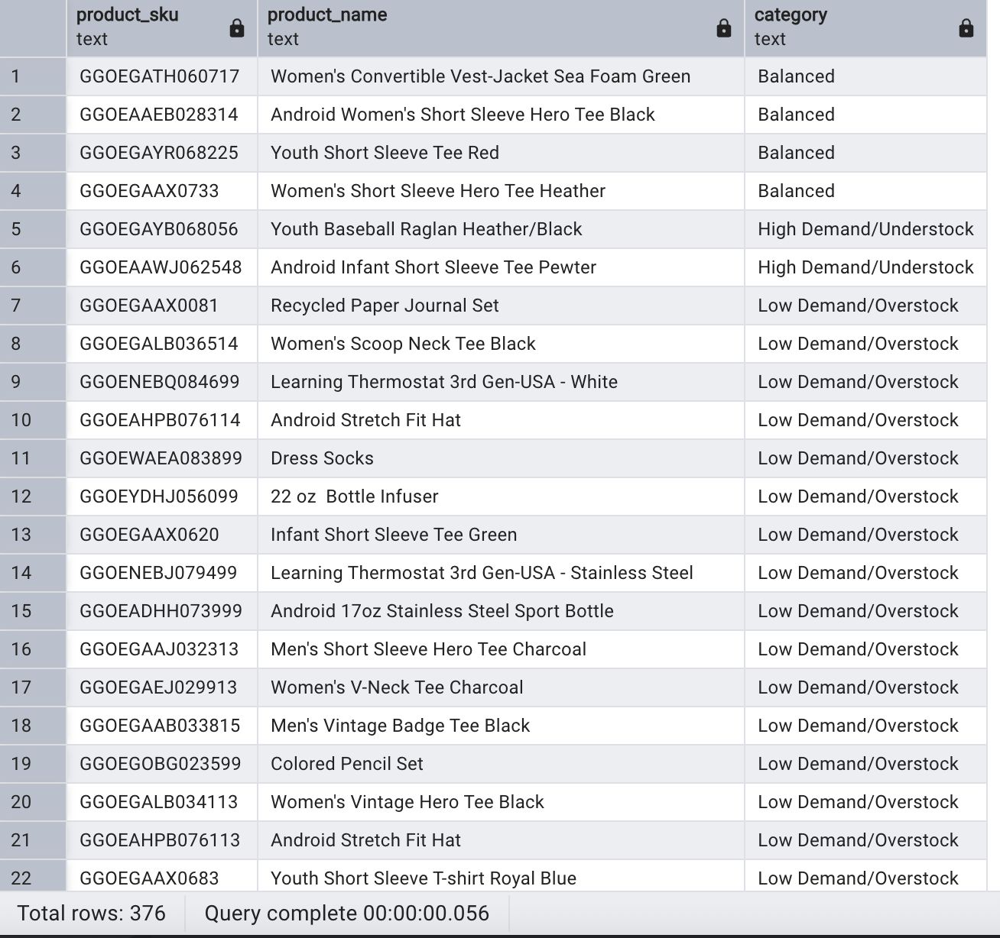

Question 1: **What is the percentage difference in revenue between analytics and all_sessions for each visit?**

SQL Queries:
```sql
WITH Analytics AS (
SELECT	visit_id,
		SUM(revenue)/1000000 AS total_revenue_analytics
FROM 	analytics
WHERE	revenue IS NOT NULL
GROUP BY visit_id
				),
AllSessions AS (				
SELECT  visit_id,
		SUM(total_transaction_revenue)/1000000 AS total_revenue_alls
FROM	all_sessions 
WHERE	total_transaction_revenue IS NOT NULL
GROUP BY visit_id
				)
SELECT	visit_id,
		total_revenue_analytics,
		total_Revenue_alls,
		100 * ((total_revenue_alls) - (total_revenue_analytics))/ total_revenue_alls AS diff	
FROM	Analytics
		JOIN AllSessions
		USING (visit_id)
ORDER BY diff DESC;
```

Answer: 


Question 2: **Which marketing channels drive the highest total revenue?**

SQL Queries:
```sql
SELECT	channel_grouping,
		SUM(total_transaction_revenue)/1000000 AS channel_revenue
FROM 	all_sessions
WHERE	total_transaction_revenue IS NOT NULL
GROUP BY channel_grouping
ORDER BY channel_revenue DESC;
```

Answer:




Question 3: **Which products with matching SKUs generate the most revenue and how much time do users spend on site?**

SQL Queries:
```sql
SELECT 	all_s.v2_product_name AS product_name,
		SUM(all_s.total_transaction_revenue/1000000) AS total_revenue,
		ROUND(AVG(all_s.time_on_site)/60) AS avg_time_on_site
FROM	all_sessions AS all_s
		JOIN products AS p
		ON p.sku = all_s.product_sku
WHERE	all_s.time_on_site IS NOT NULL 
		AND all_s.total_transaction_revenue IS NOT NULL
GROUP BY all_s.v2_product_name
ORDER BY total_revenue DESC;
```

Answer:




Question 4: **What are the yearly revenue trends in the U.S. market?**

SQL Queries:
```sql
SELECT	country,
		SUM(total_transaction_revenue)/1000000 AS total_revenue,
		EXTRACT(YEAR FROM date) AS revenue_year
FROM	all_sessions
WHERE	total_transaction_revenue IS NOT NULL
		AND country = 'United States'
GROUP BY country, EXTRACT(YEAR FROM date)
ORDER BY revenue_year;
```	

Answer:




Question 5: **Which products fall into low demand/overstock, high demand/understock, or balanced categories?**

SQL Queries:
```sql
SELECT	sr.product_sku,
		LTRIM(p.product_name) AS product_name,
		CASE
			WHEN sr.ratio < 1.0 THEN 'Low Demand/Overstock'
			WHEN sr.ratio > 1.0 THEN 'High Demand/Understock'
			WHEN sr.ratio = 1.0 THEN 'Balanced'
		END AS category
FROM	sales_report AS sr
		JOIN products AS p
		ON p.sku = sr.product_sku
WHERE	sr.ratio IS NOT NULL
ORDER BY category;
```

Answer:



