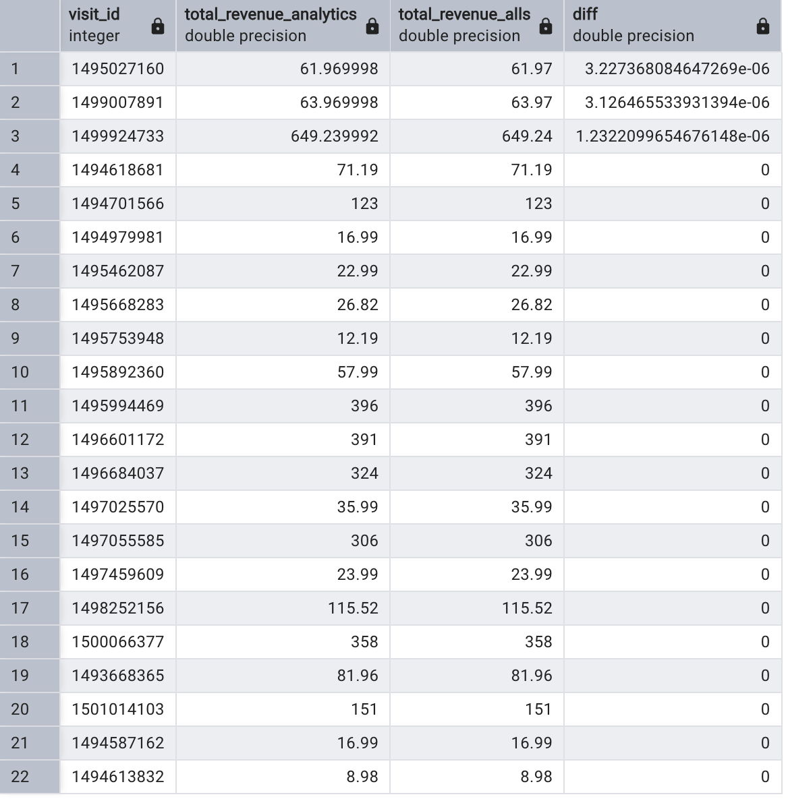

Question 1: ** What is the percentage difference in revenue between analytics and all_sessions for each visit? **

```sql
WITH Analytics AS (
SELECT	visit_id,
		SUM(revenue)/1000000 AS total_revenue_analytics
FROM 	analytics
WHERE	revenue IS NOT NULL
GROUP BY visit_id
				),
AllSessions AS (				
SELECT  visit_id,
		SUM(total_transaction_revenue)/1000000 AS total_revenue_alls
FROM	all_sessions 
WHERE	total_transaction_revenue IS NOT NULL
GROUP BY visit_id
				)
SELECT	visit_id,
		total_revenue_analytics,
		total_Revenue_alls,
		100 * ((total_revenue_alls) - (total_revenue_analytics))/ total_revenue_alls AS diff	
FROM	Analytics
		JOIN AllSessions
		USING (visit_id)
ORDER BY diff DESC;
```

Answer: 




Question 2: 

SQL Queries:

Answer:


Question 3: 

SQL Queries:

Answer:


Question 4: 

SQL Queries:

Answer:


Question 5: 

SQL Queries:

Answer:
