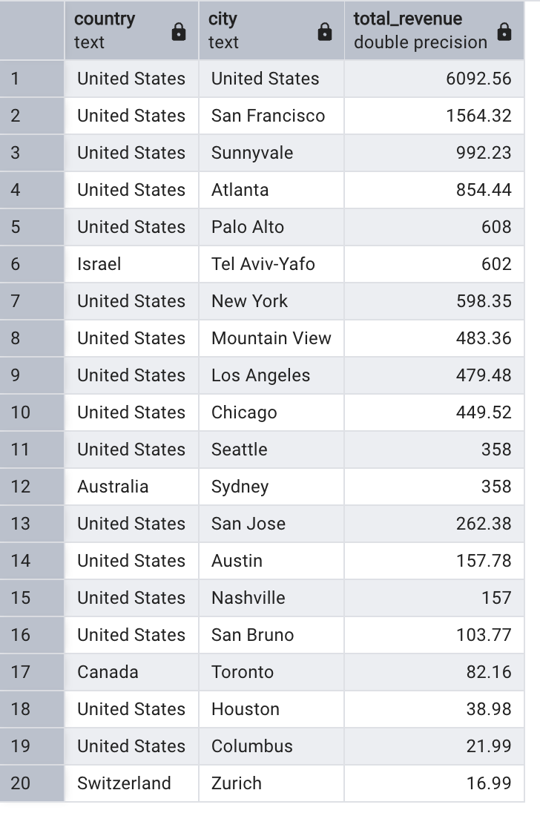
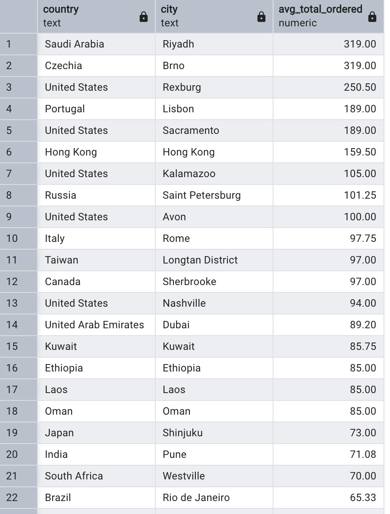
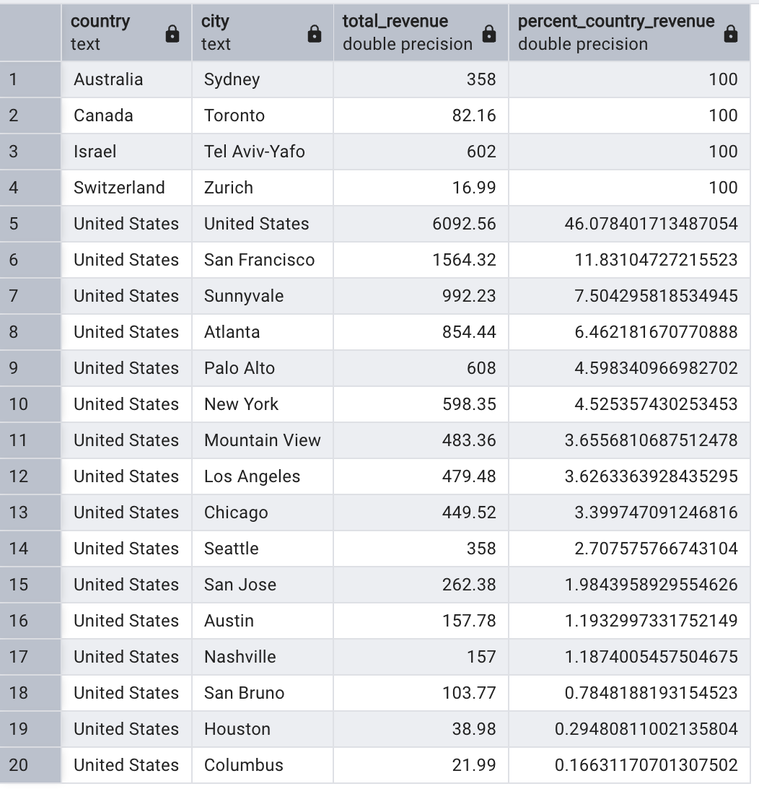

Answer the following questions and provide the SQL queries used to find the answer.

    
**Question 1: Which cities and countries have the highest level of transaction revenues on the site?**

```sql 
WITH CleanedData AS (
SELECT	CASE 
			WHEN country = 'Canada' AND city = 'New York' THEN 'United States'
            ELSE country
        	END AS country,
		CASE
			WHEN city IN ('(not set)','not available in demo dataset') THEN 'Unknown City'
			ELSE city
			END AS city,
        	total_transaction_revenue
FROM 	all_sessions
WHERE 	total_transaction_revenue IS NOT NULL
         			)
SELECT	country,
    	city,
    	SUM(total_transaction_revenue) / 1000000 AS total_revenue
FROM 	CleanedData
WHERE	city != 'Unknown City'
GROUP BY country, city
ORDER BY total_revenue DESC;
```

Answer:




**Question 2: What is the average number of products ordered from visitors in each city and country?**


```sql
WITH CleanedData AS (
SELECT	all_s.country,
		CASE
			WHEN all_s.city IN ('(not set)','not available in demo dataset') THEN 'Unknown City'
			ELSE all_s.city
			END AS city,
		ROUND(AVG(total_ordered),2) AS avg_total_ordered
FROM	sales_by_sku AS sales
		JOIN all_sessions AS all_s
		ON sales.product_sku = all_s.product_sku
WHERE 	all_s.city IS NOT NULL AND all_s.country IS NOT NULL
GROUP BY all_s.country, city
ORDER BY avg_total_ordered DESC
					)
SELECT	*
FROM	CleanedData
WHERE	city != 'Unknown City';
```

Answer:




**Question 3: Is there any pattern in the types (product categories) of products ordered from visitors in each city and country?**

```psql
WITH CleanCategories AS (
SELECT	CASE
      		WHEN country = 'Canada' AND city = 'New York' THEN 'United States'
      		ELSE country
    		END AS country,
    	CASE
      		WHEN city = 'not available in demo dataset' THEN 'Unknown'
      	ELSE city
    	END AS city,
    	REPLACE(v2_product_category, '${escCatTitle}', 'Unknown') AS cleaned_category,
		total_transaction_revenue
FROM 	all_sessions
WHERE 	total_transaction_revenue IS NOT NULL
						),
FurtherClean AS (
SELECT	country,
    	city,
	    REGEXP_REPLACE(cleaned_category, '^.*/([^/]+)/?$', '\1') AS product_category,
		total_transaction_revenue
FROM 	CleanCategories
				),

TotalRevenue AS (
SELECT	country,
		city,
		product_category,
		SUM(total_transaction_revenue)/1000000 AS total_revenue
FROM	FurtherClean
WHERE	product_category NOT IN ('(not set)', 'Unknown')
GROUP BY country, city, product_category
				),
RankBy AS (
SELECT	country,
		city,
		product_category,
		total_revenue,
		RANK () OVER(PARTITION BY country, city ORDER BY total_revenue DESC)
FROM	TotalRevenue
		)
SELECT	*
FROM 	RankBy
WHERE	rank = 1
ORDER BY country, total_revenue DESC;
```

Answer:


**Question 4: What is the top-selling product from each city/country? Can we find any pattern worthy of noting in the products sold?**

```psql
WITH CleanedData AS (
SELECT	all_s.country,
		CASE
			WHEN all_s.city IN ('(not set)','not available in demo dataset') THEN all_s.country
			ELSE all_s.city
			END AS city,
		LTRIM(p.product_name) AS product_name,	
		SUM(p.ordered_quantity) AS total_ordered
FROM	products AS p
		JOIN all_sessions AS all_s
		ON p.sku = all_s.product_sku
GROUP BY all_s.country, all_s.city, p.product_name
					),
RankedBy AS (
SELECT	country,
		city,
		product_name,
		total_ordered,
		RANK () OVER (PARTITION BY country, city ORDER BY total_ordered DESC)
FROM	CleanedData
WHERE	country != '(not set)' 
		AND city != '(not set)'
			)
SELECT	country,
		city,
		product_name,
		total_ordered
FROM	RankedBy
WHERE	rank = 1
ORDER BY country, city;
```

Answer:


**Question 5: Can we summarize the impact of revenue generated from each city/country?**

```psql
WITH CleanedData AS (
SELECT	CASE
      		WHEN country = 'Canada' AND city = 'New York' THEN 'United States'
      		ELSE country
    		END AS country,
    	CASE
      		WHEN city = 'not available in demo dataset' THEN country
      		ELSE city
    		END AS city,
    		total_transaction_revenue
FROM 	all_sessions
					),
RevenueByCity AS (
SELECT	country,
		city,
		SUM(total_transaction_revenue)/1000000 AS total_revenue
FROM	CleanedData
WHERE 	total_transaction_revenue IS NOT NULL
GROUP BY country, city
				)
SELECT	country,
  		city,
  		total_revenue,
  		100 * total_revenue/SUM(total_revenue) OVER (PARTITION BY country) AS percent_country_revenue
FROM 	RevenueByCity
ORDER BY country, percent_country_revenue DESC;
```

Answer:




